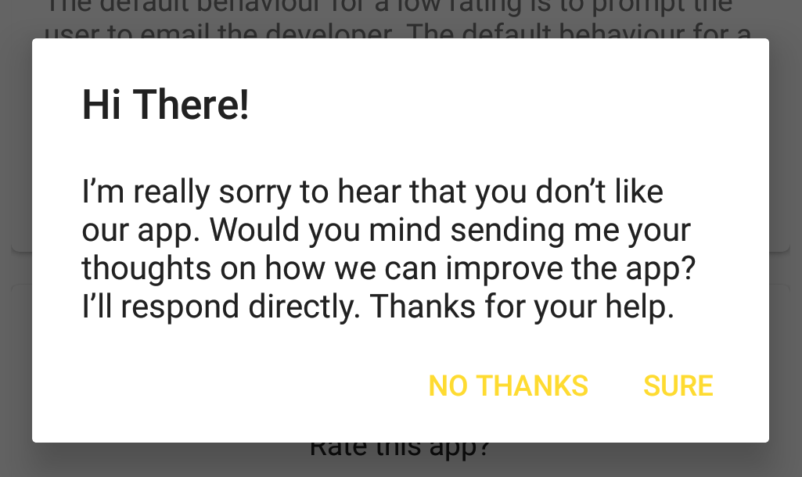
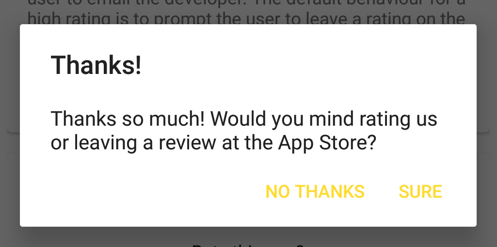
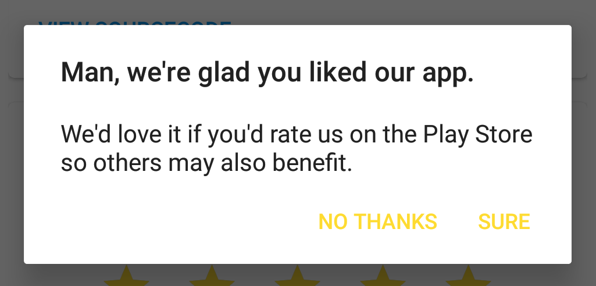

# RateTheApp

RateTheApp allows users to rate your app prompting them for further action depending on the rating they gave.


```sh
 <uk.co.brightec.ratetheapp.RateTheApp
    xmlns:app="http://schemas.android.com/apk/res-auto"
    app:rateTheAppTitleText="Rate this app?"
    android:layout_width="wrap_content"
    android:layout_height="wrap_content"
    />
```

Depending on the user's rating, an AlertDialog prompts the user for further action.
- If a rating of 0, 1 or 2 stars is selected, the user is prompted whether they would like to email the app developer with any issues they might have.  RateTheApp will remain visible so the user can re-rate your app once their issues have been resolved.


- If a rating of 3, 4 or 5 is selected, the user is prompted whether they would like to also leave a rating on the Play Store.  After a positive rating, RateTheApp is removed from view so as not to distract the user from using your app.



## Installation

Clone this repo and import the *ratetheapp* folder as a Library Module in your Android Studio project.

## Project Structure

This project is made up of 

- an *app folder*  - containing a demo app with code examples showing how to use and customise RateTheApp
- a *ratetheapp folder* - an Android Library containing the RateTheApp Android View

## Changing the appearance

#### Changing the title

The title text and appearance can be changed using the *rateTheAppTitleText* and *rateTheAppTitleTextAppearance* attributes.


```sh
 <uk.co.brightec.ratetheapp.RateTheApp
   xmlns:app="http://schemas.android.com/apk/res-auto"
   android:layout_width="wrap_content"
   android:layout_height="wrap_content"
   android:layout_gravity="center_horizontal"
   app:rateTheAppTitleText="@string/demo_customised_title"
   app:rateTheAppTitleTextAppearance="@style/Demo.TextAppearance"
  />
```

###### Title text defined in strings.xml
```sh
    <string name="demo_customised_title">Would you like to rate this app?</string>
```

###### Title style defined in styles.xml
```sh
    <style name="Demo.TextAppearance" parent="TextAppearance.AppCompat.Subhead">
        <item name="android:textColor">@color/colorPrimaryDark</item>
    </style>
```

#### Removing the title

The title can be removed altogether by setting a blank *rateTheAppTitleText* attribute.


```sh
 <uk.co.brightec.ratetheapp.RateTheApp
   xmlns:app="http://schemas.android.com/apk/res-auto"
   android:layout_width="wrap_content"
   android:layout_height="wrap_content"
   android:layout_gravity="center_horizontal"
   app:rateTheAppTitleText=""
  />
```

#### Changing the star colours

The colour of the stars can be changed using the *rateTheAppSelectedStarColor* and *rateTheAppUnselectedStarColor* attributes.


```sh
 <uk.co.brightec.ratetheapp.RateTheApp
   xmlns:app="http://schemas.android.com/apk/res-auto"
   android:layout_width="wrap_content"
   android:layout_height="wrap_content"
   android:layout_gravity="center_horizontal"
   app:rateTheAppSelectedStarColor="@color/colorPrimaryDark"
   app:rateTheAppUnselectedStarColor="@color/colorPrimary"
  />
```

###### Star colours defined in colors.xml
```sh
    <color name="colorPrimary">#2FBCED</color>
    <color name="colorPrimaryDark">#0091EA</color>
```

## Changing the behaviour

An interface *OnUserSelectedRatingListener* provides the behaviour when a user selects a rating.

```sh
    public interface OnUserSelectedRatingListener {
        void onRatingChanged(RateTheApp rateTheApp, float rating);
    }
```

The class *DefaultOnUserSelectedRatingListener* provides the default behaviour but custom implementations can also be provided.

#### Example - displaying the current rating as a number

The following example, taken from the demo app, displays a TextView showing the number of stars awarded to your app.

###### Example from demo app - fragment_custombehaviour.xml
```sh
   <TextView
       android:id="@+id/textView"
       android:layout_width="wrap_content"
       android:layout_height="wrap_content"
       android:layout_gravity="center_horizontal"
       android:paddingBottom="16dp"
       style="@style/Demo.TextAppearance"/>
       
   <uk.co.brightec.ratetheapp.RateTheApp
       android:id="@+id/customAction"
       android:layout_width="wrap_content"
       android:layout_height="wrap_content"
       android:layout_gravity="center_horizontal"/>
```

###### Example from demo app - CustomBehaviourFragment.java
```sh
   // Find the RateTheApp widget
   RateTheApp rta = (RateTheApp) view.findViewById(R.id.customAction);
   // Initialise the text view to the current rating
   final TextView textView = (TextView) view.findViewById(R.id.textView);
   textView.setText(getString(R.string.current_rating) + " " + rta.getRating());

   // Add a custom OnUserSelectedRatingListener to update the text view
   rta.setOnUserSelectedRatingListener(new RateTheApp.OnUserSelectedRatingListener() {
       @Override
       public void onRatingChanged(RateTheApp rateTheApp, float rating) {
           textView.setText(getString(R.string.current_rating) + " " + rating);
       }
   });
```

###### TextView text defined in strings.xml
```sh
        <string name="current_rating">Current rating: </string>
```

#### Example - removing any behaviour

It is possible to have no action once a user has rated your app, just set the *OnUserSelectedRatingListener* to null.

###### Example from demo app - fragment_custombehaviour.xml
```sh
   <uk.co.brightec.ratetheapp.RateTheApp
       android:id="@+id/noAction"
       android:layout_width="wrap_content"
       android:layout_height="wrap_content"
       android:layout_gravity="center_horizontal"/>
```

###### Example from demo app - CustomBehaviourFragment.java
```sh
   RateTheApp rta = (RateTheApp) view.findViewById(R.id.noAction);
   rta.setOnUserSelectedRatingListener(null);
```

## Customising the default behaviour

The class *DefaultOnUserSelectedRatingListener* provides the default behaviour but custom implementations can also be provided.

#### Changing the AlertDialog text

There are a couple of ways of changing the AlertDialog Title, Message and Button texts.
- The simpliest way is to override the string constants used by the default *DefaultOnUserSelectedRatingListener* class
- Alternatively, in code, you can set the strings on the *DefaultOnUserSelectedRatingListener* class

###### Default AlertDialog text definitions from ratetheapp/strings.xml
```sh
    <string name="ratetheapp_goodrating_title">Thanks!</string>
    <string name="ratetheapp_goodrating_text">Thanks so much!  Would you mind rating us or leaving a review at the App Store?</string>
    <string name="ratetheapp_positive_button">Sure</string>
    <string name="ratetheapp_negative_button">No Thanks</string>
    <string name="ratetheapp_badrating_title">Hi There!</string>
    <string name="ratetheapp_badrating_text">I’m really sorry to hear that you don’t like our app. Would you mind sending me your thoughts on how we can improve the app? I’ll respond directly. Thanks for your help.</string>
```

###### Example overriding some strings - from the demo app, strings.xml
```sh
    <string name="demo_badrating_text">We\'re sorry to hear that you don\'t like our demo. Would you mind sending us your thoughts on how we can improve it?\n\nThanks for your help,\nThe Brightec Team</string>
    <string name="demo_goodrating_title">Thank you!</string>
    <string name="demo_goodrating_text">Thanks, that\'s great to hear!  Would you mind rating us or leaving a review on the Google Play Store?\n\nThanks again,\nThe Brightec Team</string>
```


###### Example showing how to change the text in code.
```sh
 RateTheApp rta = (RateTheApp) view.findViewById(R.id.noAction);
 DefaultOnUserSelectedRatingListener defaultListener = (DefaultOnUserSelectedRatingListener) rta.getOnUserSelectedRatingListener();
 defaultListener.setGoodRatingTitle("Man, we're glad you liked our app.");
 defaultListener.setGoodRatingMessage("We'd love it if you'd rate us on the Play Store so others may also benefit.");
```



#### Changing the email template text

## Displaying multiple instances of RateTheApp

To use RateTheApp more than once within an app, a unique *rateTheAppName* attribute should be set each time.

###### Example from demo app - showing different rateTheAppName settings 
```sh
 <uk.co.brightec.ratetheapp.RateTheApp
 android:id="@+id/noAction"
 app:rateTheAppName="noActionWidget"
 android:layout_width="wrap_content"
 android:layout_height="wrap_content"
 android:layout_gravity="center_horizontal"/>
 
<uk.co.brightec.ratetheapp.RateTheApp
android:id="@+id/customAction"
app:rateTheAppName="customActionWidget"
android:layout_width="wrap_content"
android:layout_height="wrap_content"
android:layout_gravity="center_horizontal"/>
```

##### Why is it necessary to specify a unique name?

The user's rating and whether RateTheApp should be displayed or not are stored as user preferences so that the correct number of stars are remembered the next time the user sees the screen.  The *rateTheAppName* attribute is used as a key when storing user preferences.

##### How is the information stored?

The information is stored using the following User Preferences keys
- *ratetheapp_XX_rating* stores the user's rating as a float value
- *ratetheapp_XX_show* stores whether RateTheApp should be displayed as a boolean value

where *XX* is the value of the *rateTheAppName* attribute (which defaults to *rate_the_app* if not specified).  This means that unless the *rateTheAppName* attribute is changed from the default, all instances of the RateTheApp will share the same rating and display values.

## Contributors

Feel free to use and improve this project - contributions are welcome.

If you find a problem, please create an issue https://github.com/brightec/RateTheApp-Android/issues (alternatively, fix the code and create a pull request) ;-)

## License

A short snippet describing the license (MIT, Apache, etc.)
